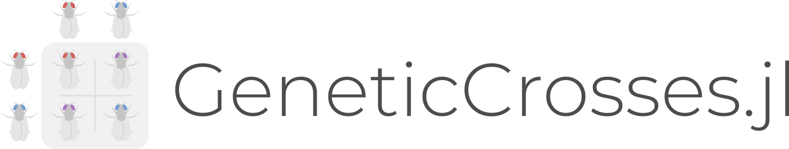

## Simulate breeding crosses between individuals

This package builds off of [PopGen.jl](http://github.com/pdimens/PopGen.jl) and 
simulates offspring that would be generated by crossing (mating) two individuals. 

### Installation
```julia
julia>]

pkg(v1.5)> add "http://github.com/pdimens/GeneticCrosses.jl"
```

### Usage
```
julia> using GeneticCrosses

# to use included dataset
julia> cats = nancycats()

# to use your own data
julia> data = read_from("path/to/filename.ext", kwargs...);

# perform a cross
julia> f1 = cross(data, "sample1", "sample2", n = 100000) ;

# perform a backcross
julia> f2_backcross = cross(data, f1, parent1 = "sample1", parent2 = "offspring_99", n = 100000, generation = "F2") ;

# merge PopData objects
crossed_sims = append(data, f1)
```

Currently, `GeneticCrosses.jl` can create crosses for:
- haploids (ploidy = 1)
- diploids (ploidy = 2)
- tetraploids (ploidy = 4) 
- hexaploids (ploidy = 6)
- octaploids (ploidy = 8)

To learn more about reading in data, see the docstring `?read_from` or read the [PopGen.jl docs section](https://pdimens.github.io/PopGen.jl/docs/io/file_import) on it.

To learn more about crossing and backcrossing, see their docstrings `?cross` and `?backcross` respectively.
