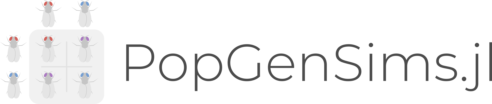
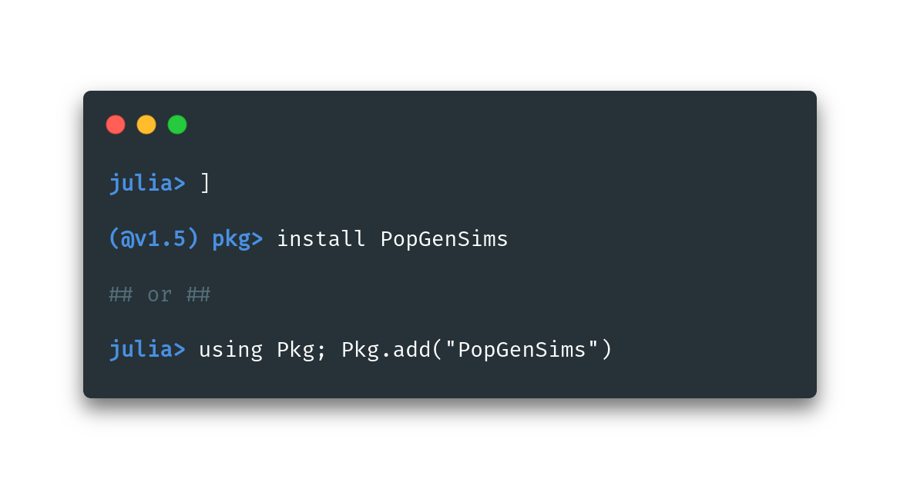

## Create population genetics simulations

This package builds off of [PopGen.jl](http://github.com/BioJulia/PopGen.jl) and 
simulates offspring that would be generated under certain conditions. With this package you can simulate the offspring of specific individuals, simulate full-sibs, half-sibs, unrelated individuals, and parent-offspring pairs for use with PopGen.jl. You can also randomly generate samples given population-specific allele frequencies.

### Installation

### Usage
Documentation for PopGenSims.jl has been integrated into [the PopGen.jl docs](https://pdimens.github.io/PopGen.jl/docs/simulations/simulate_samples)
